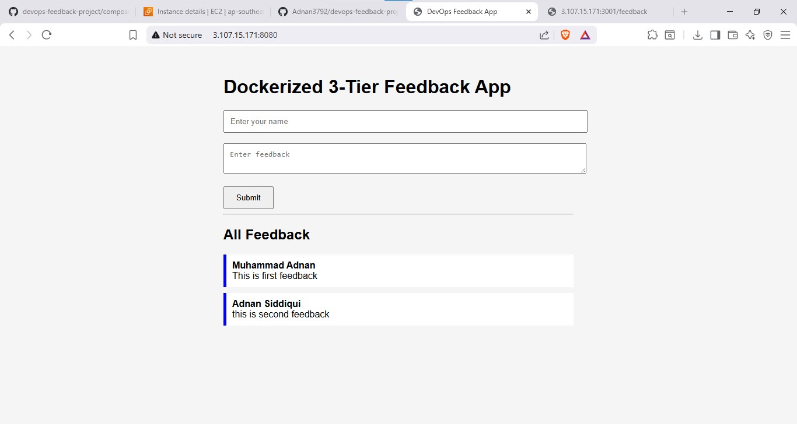
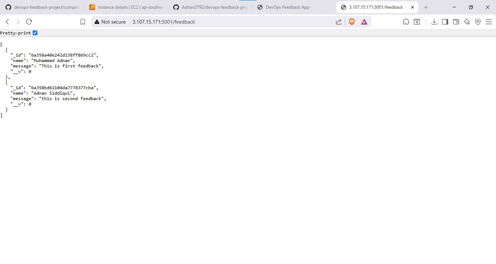
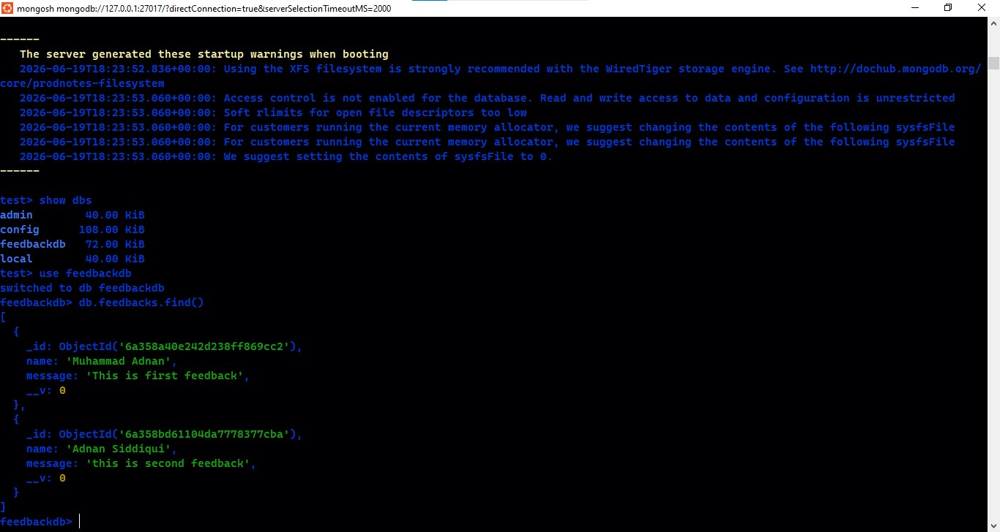
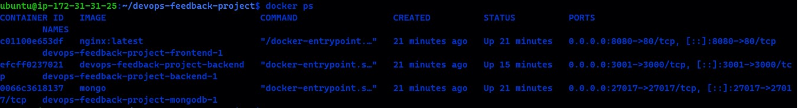
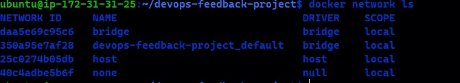
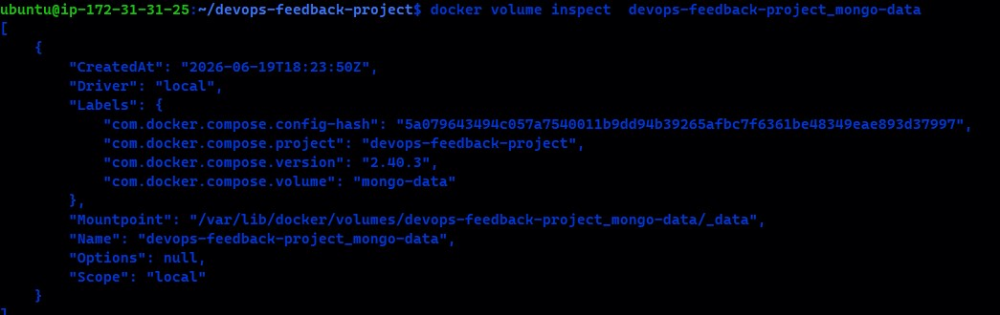
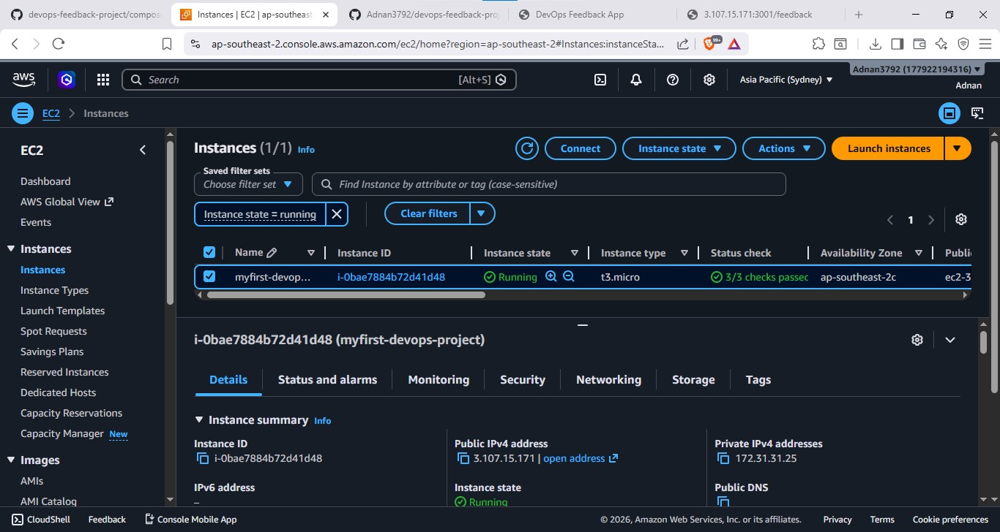
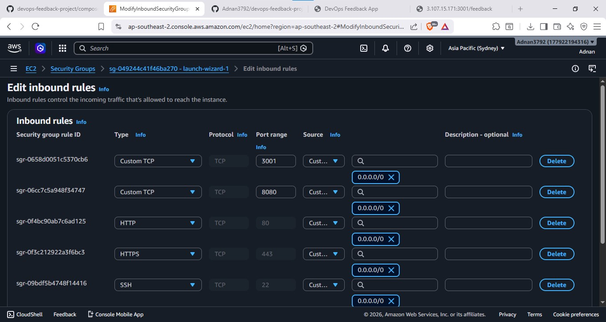

# Dockerized 3-Tier Feedback Application

## Project Overview

This project is a Dockerized 3-tier web application deployed on AWS EC2.

The application allows users to submit feedback through a web interface. The feedback is sent to a backend REST API and stored in MongoDB.

## Architecture

Frontend (HTML, CSS, JavaScript)
↓
Backend (Node.js, Express)
↓
MongoDB Database

All components are containerized using Docker and managed using Docker Compose.

## Technologies Used

* Linux (Ubuntu)
* Docker
* Docker Compose
* Node.js
* Express.js
* MongoDB
* HTML
* CSS
* JavaScript
* Git & GitHub
* AWS EC2
* SSH

## Project Structure

feedback-app/

├── frontend/

│ ├── index.html

│ ├── style.css

│ └── script.js

├── backend/

│ ├── app.js

│ ├── package.json

│ └── Dockerfile

├── compose.yaml

├── screenshots

## Features

* Submit feedback through web interface
* Store feedback in MongoDB
* Retrieve feedback using REST API
* Dockerized frontend, backend, and database
* Persistent MongoDB storage using Docker Volumes
* Container communication using Docker Network
* Deployed on AWS EC2

## Docker Containers

* Frontend (Nginx)
* Backend (Node.js + Express)
* MongoDB

## Running the Application

Clone Repository

git clone https://github.com/Adnan3792/devops-feedback-project

Navigate to project directory

cd feedback-app

Start containers

docker compose up -d --build

Check running containers

docker ps

## Accessing the Application 

After deployment, open:

http://localhost:8080

## AWS Deployment

The application was successfully deployed on AWS EC2 using Docker Compose.

Deployment screenshots are included below.

## Docker Concepts Demonstrated

* Docker Images
* Docker Containers
* Dockerfile
* Docker Compose
* Docker Networking
* Docker Volumes
* Container Communication

## AWS Concepts Demonstrated

* EC2 Instance
* Security Groups
* SSH Authentication
* Public IP Access
* Linux Server Administration

## Learning Outcomes

Through this project I learned:

* Building and containerizing applications
* Multi-container deployment using Docker Compose
* Persistent storage with Docker Volumes
* Container networking and service discovery
* Deploying applications on AWS EC2
* Managing Linux servers using SSH
* Git and GitHub workflow

## Future Improvements

* Nginx Reverse Proxy
* CI/CD using GitHub Actions
* AWS ECR Integration
* HTTPS with SSL/TLS
* Monitoring using Prometheus and Grafana
* Kubernetes Deployment
# Screenshots

## Application UI

## Backend API Output

## MongoDB Data

## Docker Containers

## Docker Network

## Docker Volume

## AWS EC2 Instance

## Security Group Configuration

## Author

Muhammad Adnan

Aspiring DevOps Engineer
